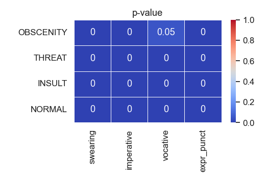
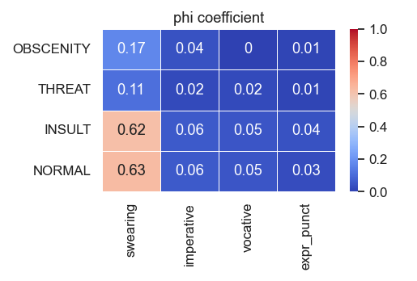
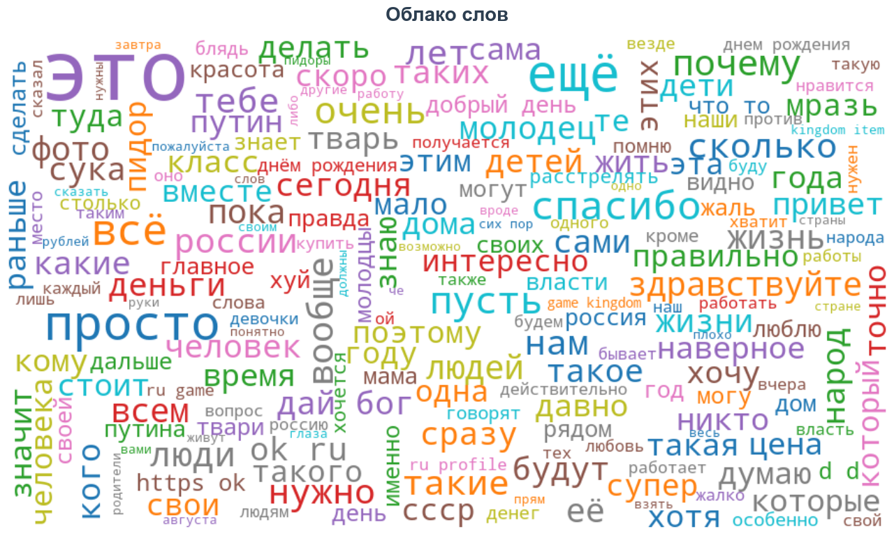
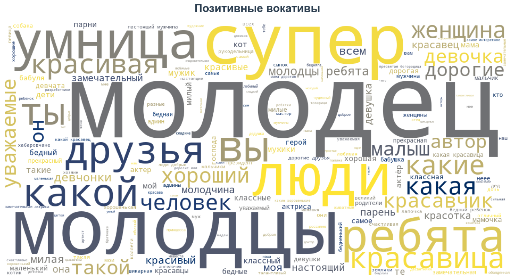
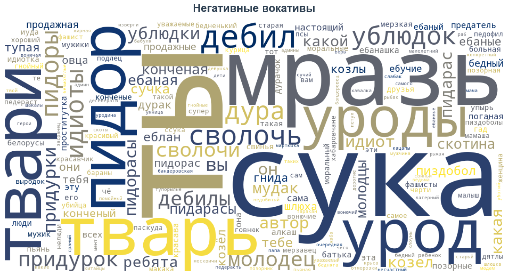
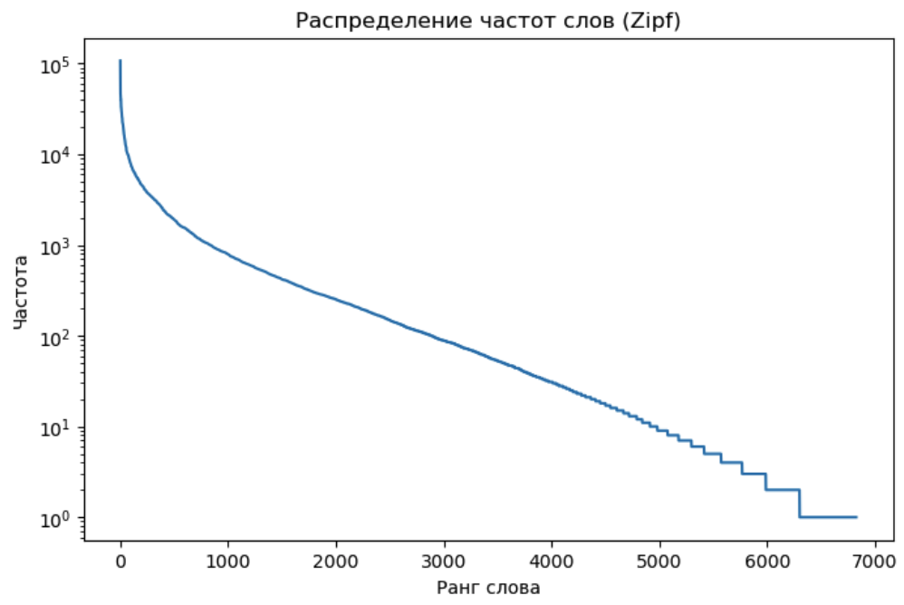
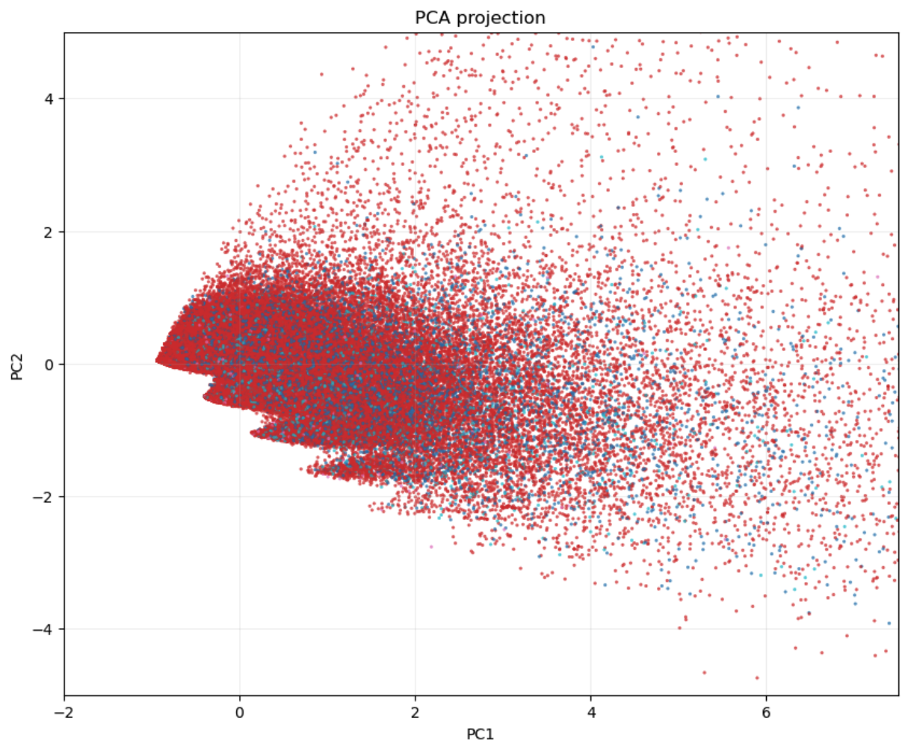
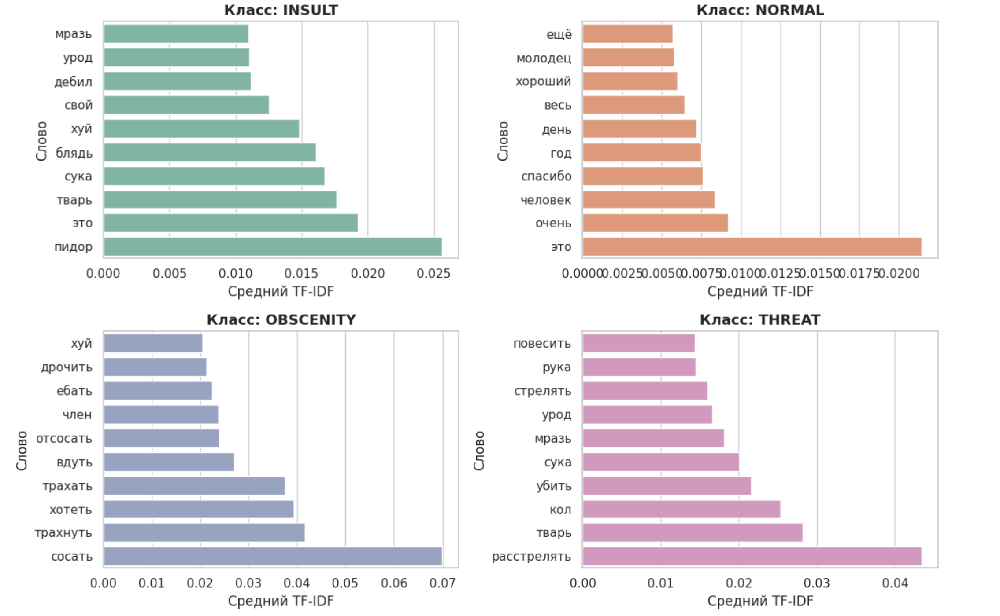

# Разведочный анализ данных

**1. Описание данных:**
- в датасете почти 250 тыс. комментариев
- нет пропусков
- все комментарии в нижнем регистре
- есть только один дублирующийся комментарий
- самый частый класс - нормальный комментарий

**2. Сбалансированность классов**

Доля нормальных комментариев больше 80%. Данные сильно несбалансированны, это необходимо будет учитывать при выборе метрик качества моделей.
Разные классы токсичных комментариев также представлены не равномерно, среди них преобладает INSULT. Для решения этой проблемы
комментарии изначально отнесенные к нескольким классам были переразмечены одним классом, приоритет отдавался наименее представленным. 

**3. Новые признаки**
- Добавлены численные признаки: длина комментария в символах, количество слов, средняя длина слова.
- Добавлен признак наличия мата в комментарии, мат содержится в 8.4% комментариев.
- Добавлены признаки для трех типов эмодзи (позитивные, негативные, пошлые).
- Добавлены категориальные признаки: наличие вокатива (существительного в звательном падеже), наличие глаголов в императивной форме,
  наличие экспрессивной пунктуации.
- Добавлены численные признаки: количество местоимений второго лица, третьего лица и количество прилагательных.

**3. Статистический анализ**

Были проведены статистические тесты на нормальность, равенство дисперсий, двусторонние и односторонние тесты на равенство средних
по количеству символов, количеству слов и средней длине слов в комментариях между токсичными и нетоксичными комментариями.
В результате было выявлено:
- Нормальные комментарии статистически короче токсичных
- Нормальные комментарии содержат статистически меньше слов, чем токсичные
- Нормальные комментарии содержат статистически более длинные слова, чем ненормальные
- При этом коэффициент d Коэна показывает очень маленький эффект во всех случаях

Была исследована взаимосвязь между наличием вокатива, императива, экспрессивной пунктуации и классом комментария. Критерий
хи-квадрат показал, что существует статистически значимая зависимость между наличием почти всех перечисленных признаков в отдельности
и классом токсичности комментария. Опровергнуть независимость не удалось только для комбинации признаков: класс OBSCENITY и наличие вокатива.

Несмотря на наличие зависимости, ее сила достаточно слабая. На тепловой карте коэффициента $\phi$ для сравнения добавлен
признак наличия мата. Из этого можно сделать вывод, что по отдельности признаки наличия вокатива, императива,
экспрессивной пунктуации не могут являться хорошими предикторами класса, в отличие от наличия мата. С другой стороны, 
наличие мата слабо связано с классами THREAT и OBSCENITY.

Также был проведен анализ зависимости между количеством прилагательных, местоимений 2го и 3го лица и классом токсичности.
Все признаки распределены ненормально, есть слабая статистически значимая зависимость между ними и классом NORMAL. Интересно,
что зависимость между этими признаками и классами токсичных комментариев (THREAT, OBSCENITY, INSULT) более сильная. Так,
например:
- в комментариях класса INSULT больше местоимений 2 лица, чем в классе THREAT
- в комментариях класса INSULT больше прилагательных, чем в классе THREAT
- в комментариях класса INSULT больше прилагательных, чем в классе OBSCENITY

**4. Графический анализ**

Графики, касающиеся распределения кол-ва символов, кол-ва слов и средней длине слов в комментариях визуально отличаются незначительно, но все же можно выделить несколько моментов:
- Комментарии с оскорблениями (INSULT) реже имеют комментарии с кол-вом символов меньше 50 по сравнению с другими категориями. Комментарии с описанием или угрозой сексуального насилия (OBSCENITY), наоборот, чаще ограничиваются 50ю символами
- Распределение по кол-ву слов сильно похоже на распределение по кол-ву символов и эти признаки имеют высокую положительную корреляцию (может в будущем создать проблему мультиколлинеарности)
- Токсичные комментарии визуально практически не имеют отличий по распределению по средней длине слов между различными классами токсичности, но чаще имеют среднюю длину до 5 по сравнению с нормальными
- Для "нетоксичных" комментариев практически не свойственен мат, а для остальных классов отношение матерных и нематерных комментариев варьируется:

- Получаются следующие условные вероятности: P(toxic | swearing=1) = 0.983; P(toxic | swearing=0) = 0.106
- Распределения классов по признаку наличия позитивного эмодзи в сообщении:

- Распределения классов по признаку наличия негативного эмодзи в сообщении:

- Распределения классов по признаку наличия позитивного эмодзи в сообщении:

- Сильная корреляция замечена между токсичностью и наличием мата:

- Эмодзи встречаются в комментариях редко, поэтому их нельзя назвать очень надежным признаком для определения токсичности комментария, однако в отдельных случаях они могут позволить сделать более точный прогноз, потому что их распределение по разным классам достаточно показательно.

Судя по облаку слов, частыми темами обсуждений в комментариях являются: политика (россия, народ, власть, путин, ссср),
финансы (деньги, цена, работать, купить), поздравления с днем рождения (днем рождения, днём рождения)

Также были построены облака для вокативов. Так самыми частыми обращениями в хорошем ключе явлюятся "молодец", "супер",
"друзья", "красавица". Самыми частыми обращениями среди токсичных комментариев было: "мразь", "с\*ка", "п*дор", "тварь",
"урод".

**5. Bag of words и биграммы** (автор этой части - Кирилл Десятниченко)
В конце EDA мы постарались построить и проанализировать признаки, которые показывают лучшее качество в сочетании с моделями машинного обучения. 

Для представления текстов в числовом виде была использована модель Bag of Words (мешок слов), которая отображает каждый документ как вектор частот токенов. Предварительно были проведены нормализация текста и удаление стоп слов. Использовался предобученный токенайзер из библиотеки transformers: `AutoTokenizer.from_pretrained("cointegrated/rubert-tiny-toxicity")`. Размер итогового словаря - 6823 токена. Количество токенов в самом токенайзере примерно 29 тысяч. Скорее всего разнообразие потерялось из-за нормализации текста.

Распределение частот слов подчиняется закону Ципфа: большинство слов встречается редко, тогда как небольшое число — очень часто. Это свидетельствует о естественности корпуса и его лексическом разнообразии.

Была предпринята попытка спроецировать вектора частот токенов на 2 координаты с помощью PCA. Токсичные и нетоксичные комментарии пересекаются достаточно сильно, что указывает на отсутствие жёстких линейных границ между классами в пространстве признаков.

Помимо bag of words, использовалась модель TF-iDF. Она позволила получить информацию о самых характерных для каждого класса словах. К сожалению в графике очень много нецензурной брани, смотрите на свой страх и риск. По крайней мере визуализация чётко демонстрирует тематическое и лексическое разделение между классами токсичных и нейтральных сообщений.

На этом этапе мы нашли очень частый выброс - в датасете очень много предложений такого вида - `__label__NORMAL сбербанк онлайн чек по операции онлайн сбегбанк сперация ...`.

Также были найдены самые частые для токсичнх и нормальных комментариев биграммы, к сожалению там слишком матов и мне стыдно вставлять их сюда. 

Небольшой вывод: собранный корпус обладает достаточным лексическим разнообразием и естественным распределением слов, и сформированные признаки можно считать адекватной основой для классических моделей машинного обучения (логистическая регрессия, SVM, деревья решений). Однако их эффективность, скорее всего, будет ограничена, т.к. признаки не учитывают смысловую связь между словами. 
