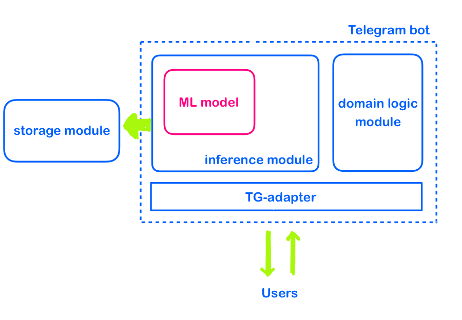

# Годовой проект. Магистратура ИИ25
**Тема:** Детекция токсичных сообщений/комментариев

**Участники:** Кайгородцева Дарья, Сморчкова Юлиана, Соколов Даниил, Десятниченко Кирилл

**Куратор:** Надежда Гераськина

## Годовой план

### 📊 Описание данных:

**📁 Источник данных:** [“Toxic Russian Comments”](https://www.kaggle.com/datasets/alexandersemiletov/toxic-russian-comments/data) на Kaggle  
**🌐 Платформа сбора:** [Одноклассники](https://ok.ru/)  
**📊 Объем данных:** > 200 тыс. комментариев  

**🏷️ Классы комментариев:**
- Нормальный
- Угроза  
- Оскорбление
- Описание или угроза сексуального насилия

**⚖️ Проблема:** Несбалансированные данные (82% комментариев - нетоксичные)

**Разведочный анализ (EDA)**
1. Проверить качество данных: проверить качество разметки, оценить наличие пропусков и дубликатов
2. Проверить насколько сбалансированы классы в датасете
3. Статистический анализ: 
      - Оценить наличие пропусков
      - Оценить распределение длины сообщений (по символам, токенам, предложениям)
      - Подвести статистику (медиана, среднее, минимум, максимум, мода и т.д.) (по длине)
      - Найти аномалии (по длине)
4. Feature engineering: cформулировать гипотезы о том, какие признаки влияют на классы токсичности, проверить зависимость сгенерированных признаков от класса
   Возможные гипотезы:
   - проверить самые частые символы/слова/токены в датасете по классам
   - оценить частоту стоп слов
   - оценить частоту матерных лексем по классам
   - оценить частоту заглавных букв/эмодзи/знаков препинания
   - TF-iDF, n-граммы (1-2). 
5. Визуализация данных: построить диаграммы, иллюстрирующие зависимость целевого признака от сгененрированных
   - облако слов по классам / частотный анализ биграмм
   - гистограммы по длине комментария/средней длине слов в комментариях/доле заглавных букв среди токсик/нетоксик
   - диаграммы распределения признаков по классам (scatterplot и подобное)

### 🙈 Блок ML

Наилучшие результаты в задачах классификации текстов, как правило, демонстрируют нейросетевые модели. Поэтому основная цель этапа классического машинного обучения заключается не в достижении максимального качества, а в построении надежного **базового решения (baseline)** и, желательно, получении **интерпретируемых результатов**.

1) Выбрать подходящие метрики качества для нашей задачи классификации. 
2) Добавить следующие признаки:
	- Bag of words 
	- TF-iDF
3) Обучить следующие модели - **Логистическая регрессия**, **Наивный Байес**, **линейный SVM**, с учетом дизбаланса в данных.
4) Оценить качество полученных моделей. Интрепретировать результаты. Определить бейзлайн для нейросетевых моделей.  

### 🧠 Блок DL:

Планируем реализовать в проекте следующие модели:

**RNN.** Модель анализирует текст последовательно, после каждого нового слова корректируя оценку токсичности комментария. То есть в отличии от более примитивных методов, использующих bag of words, она способна учитывать взаимосвязь и порядок слов. 

**LSTM.** Усовершенствованная модель RNN, которая лучше работает с длинными последовательностями, так как она сохраняет в памяти "ключевые" слова, даже если они были в начале текста, решая проблему "забывчивости" обычных RNN.

**BERT.** Основанная на трансформерах модель, которая воспринимает текст не последовательно слово за словом, а сразу целиком и способна улавливать более тонкие конструкции (например, сарказм). Ее модификация RuBERT изначально предобученна на огромных массивах данных на русском языке, но может быть также дообучена на нашем датасете.

**Ансамблевые методы.** Комбинируют прогнозы нескольких моделей (BERT, LSTM и т.д.), что, как правило, помогает получить более высокие оценочные метрики. Для выявления "победившего" класса может использоваться метод голосования, стекинг или взвешенное среднее.

| Модель | Требования к памяти | Скорость | Точность |
|--------|---------------------|----------|----------|
| 🤖 RNN | 🟢 Низкие | 🟢 Высокая | 🟡 Средняя |
| 🔍 LSTM | 🟡 Средние | 🟡 Средняя | 🟢 Высокая |
| 🚀 BERT | 🔴 Высокие | 🔴 Низкая | 🟢 Очень высокая |

### Блок Сервис:

Обученную модель планируется внедрить в тг-бот, который будет анализировать каждое сообщение в чате и срабатывать,
если классифицирует его как токсичное.

Инфрастуктура бота будет включать модуль для хранения данных сообщений и результатов классификации для дальнейшего анализа
ошибок модели и отслеживания изменения распределения классов или признаков.  

При достаточном количестве времени и данных планируем реализовать инкрементальное дообучение модели в ходе эксплуатации,
построив пайплайн сбора данных из чатов:

1. сбор обратной связи от пользователей по ошибкам классификации модели 
2. валидация, очистка и кодирование данных для повторного обучения
3. дообучение модели и оценка качества
4. внедрение обновленной модели

