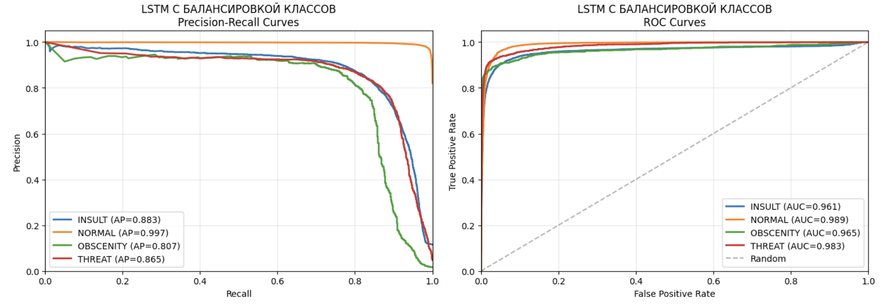
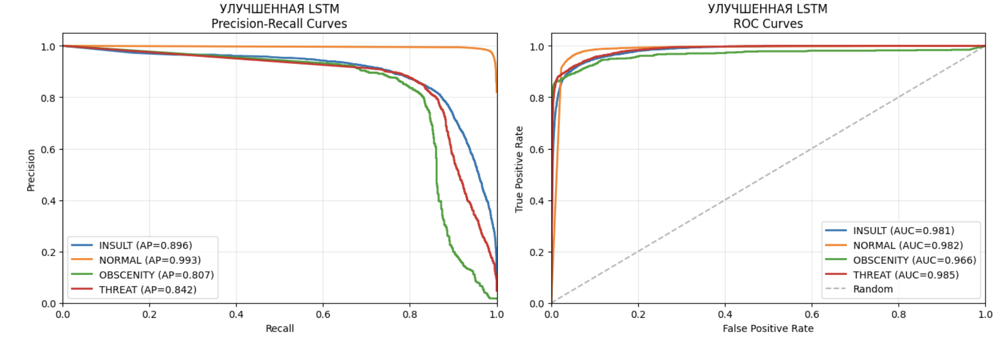

# DL-модели

## Сводная таблица результатов лучших моделей

| Признаки                            | Модель             | F1-macro |
|-------------------------------------|--------------------|----------|
| fasttext                            | Улучшенная LSTM    | 0.87     |
| BoW                                 | LogisticRegression | 0.82     |
| fasttext                            | LightGBM           | 0.75     |
| tf-idf                              | CatBoost           | 0.74     |

## RNN, LSTM, GRU

## Таблица результатов

| Модель             | F1-macro | 
|--------------------|----------|
| 1. VANILLA RNN     | 0.716     |
| 2. БАЗОВАЯ LSTM    | 0.86     |
| 3. LSTM С БАЛАНСИРОВКОЙ КЛАССОВ| 0.864   |
| 4. УЛУЧШЕННАЯ LSTM | 0.868     |
| 5. УЛУЧШЕННАЯ LSTM С ВЕСАМИ В CrossEntropyLoss     | 0.855    |
| 6. БАЗОВАЯ GRU    | 0.859     |
| 7. GRU С БАЛАНСИРОВКОЙ КЛАССОВ     | 0.857     |

#### **МОДЕЛЬ 1: VANILLA RNN (BASELINE)**  
Характеристики:
- Простая однослойная RNN
- hidden_dim=32
- Без dropout
- Без балансировки классов
- Обычный CrossEntropyLoss
- lr=0.001

Метрики:
- F1-macro = 0.716
- F1-weighted = 0.93
- ROC-AUC = 0.97

Время обучения: 6.43 минут

Время инференса: 0.75 секунд

#### **МОДЕЛЬ 2: БАЗОВАЯ LSTM**  
Характеристики:
- 2 слоя LSTM 
- hidden_dim=128
- Dropout=0.3
- Без балансировки классов
- Обычный CrossEntropyLoss
- lr=0.001

Метрики:
- F1-macro = 0.86
- F1-weighted = 0.95
- ROC-AUC = 0.98

Время обучения: 8.91 минут

Время инференса: 1.28 секунд

#### **МОДЕЛЬ 3: LSTM С БАЛАНСИРОВКОЙ КЛАССОВ**  
Характеристики:
- 2 слоя LSTM
- hidden_dim=128
- Dropout=0.3
- WeightedRandomSampler для балансировки классов
- Обычный CrossEntropyLoss
- lr=0.001

Метрики:
- F1-macro = 0.864
- F1-weighted = 0.95
- ROC-AUC = 0.97

Время обучения: 8.94 минут

Время инференса: 1.27 секунд

#### **МОДЕЛЬ 4: УЛУЧШЕННАЯ LSTM**  
Характеристики:
- 3 слоя LSTM
- hidden_dim=256
- Dropout=0.4
- Bidirectional = True (двунаправленная)
- WeightedRandomSampler
- Обычный CrossEntropyLoss
- lr=0.001

Метрики:
- F1-macro = 0.868
- F1-weighted = 0.96
- ROC-AUC = 0.98

Время обучения: 60.37 минут

Время инференса: 6.32 секунд

#### **МОДЕЛЬ 5: УЛУЧШЕННАЯ LSTM С ВЕСАМИ В CrossEntropyLoss**  
Характеристики:
- 3 слоя LSTM
- hidden_dim=256
- Dropout=0.4
- Bidirectional = True
- Без WeightedRandomSampler
- Веса в CrossEntropyLoss
- lr=0.001

Метрики:
- F1-macro = 0.855
- F1-weighted = 0.95
- ROC-AUC = 0.98

Время обучения: 11.85 минут

Время инференса: 1.08 секунд

#### **МОДЕЛЬ 6: БАЗОВАЯ GRU**  
Характеристики:
- 2 слоя GRU
- hidden_dim=128
- Dropout=0.3
- Без WeightedRandomSampler
- Обычный CrossEntropyLoss
- lr=0.001

Метрики:
- F1-macro = 0.859
- F1-weighted = 0.95
- ROC-AUC = 0.99

Время обучения: 2.59 минут

Время инференса: 0.29 секунд

#### **МОДЕЛЬ 7: GRU С БАЛАНСИРОВКОЙ КЛАССОВ**  
Характеристики:
- 2 слоя GRU
- hidden_dim=128
- Dropout=0.3
- WeightedRandomSampler для балансировки
- Обычный CrossEntropyLoss
- lr=0.001

Метрики:
- F1-macro = 0.857
- F1-weighted = 0.95
- ROC-AUC = 0.97

Время обучения: 2.59 минут

Время инференса: 0.29 секунд

**Выводы:**  
Наиболее высокое качество показала модель LSTM с 3 слоями, с увеличенным размером скрытого слоя и двунаправленная : **F1 macro = 0.868**. Тем не менее, следующая после него более простая модель LSTM c WeightedRandomSampler показывает **F1 macro = 0.864**, что лишь незначительно ниже, зато время обучения и време инференса у нее в разы меньше. При этом во всех моделях наибольшей проблемой все еще является сложность с определением конкретного типа токсичности, так как f1-score у класса NORMAL достигло 0.98
 
