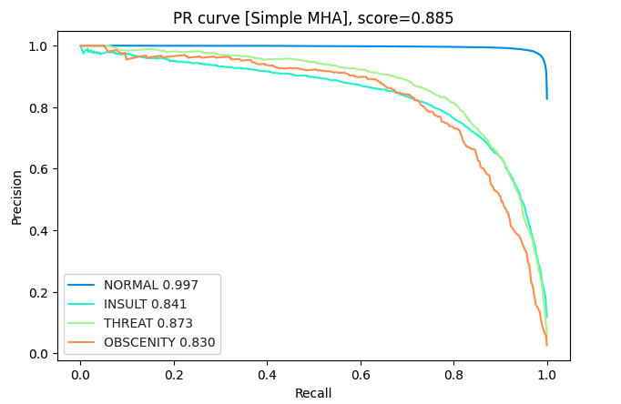
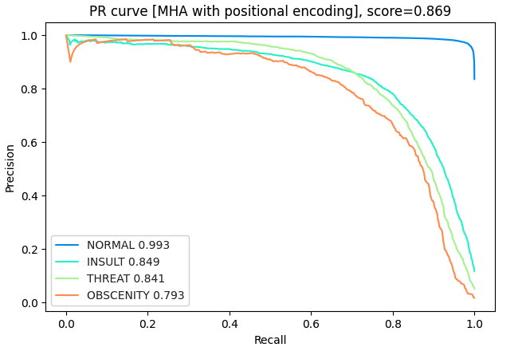
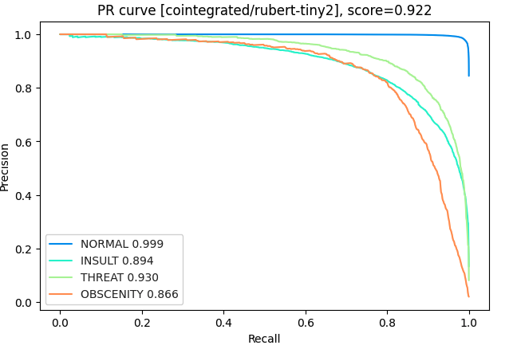
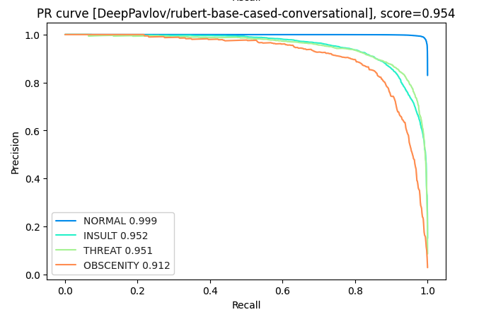

# DL-модели

## Сводная таблица результатов лучших моделей по всем чекпоинтам

| Признаки        | Модель                                                | F1-macro |
|-----------------|-------------------------------------------------------|----------|
| BERT Embeddings | Finetuned DeepPavlov/rubert-base-cased-conversational | 0.89     | 
| fasttext        | Улучшенная LSTM                                       | 0.87     |
| BERT Embeddings | Собственный BERT с балансировкой классов              | 0.837    |
| BoW             | LogisticRegression                                    | 0.82     | 
| fasttext        | LightGBM                                              | 0.75     |
| tf-idf          | CatBoost                                              | 0.74     | 

## RNN, LSTM, GRU

[Подробнее тут](./Smorchkova_DL.ipynb)

### Таблица результатов

| Модель                                         | F1-macro | 
|------------------------------------------------|----------|
| 1. VANILLA RNN                                 | 0.716    |
| 2. БАЗОВАЯ LSTM                                | 0.86     |
| 3. LSTM С БАЛАНСИРОВКОЙ КЛАССОВ                | 0.864    |
| 4. УЛУЧШЕННАЯ LSTM                             | 0.868    |
| 5. УЛУЧШЕННАЯ LSTM С ВЕСАМИ В CrossEntropyLoss | 0.855    |
| 6. БАЗОВАЯ GRU                                 | 0.859    |
| 7. GRU С БАЛАНСИРОВКОЙ КЛАССОВ                 | 0.857    |

#### **МОДЕЛЬ 1: VANILLA RNN (BASELINE)**  
Характеристики:
- Простая однослойная RNN
- hidden_dim=32
- Без dropout
- Без балансировки классов
- Обычный CrossEntropyLoss
- lr=0.001

Метрики:
- F1-macro = 0.716
- F1-weighted = 0.93
- ROC-AUC = 0.97

Время обучения: 6.43 минут

Время инференса: 0.75 секунд

#### **МОДЕЛЬ 2: БАЗОВАЯ LSTM**  
Характеристики:
- 2 слоя LSTM 
- hidden_dim=128
- Dropout=0.3
- Без балансировки классов
- Обычный CrossEntropyLoss
- lr=0.001

Метрики:
- F1-macro = 0.86
- F1-weighted = 0.95
- ROC-AUC = 0.98

Время обучения: 8.91 минут

Время инференса: 1.28 секунд

#### **МОДЕЛЬ 3: LSTM С БАЛАНСИРОВКОЙ КЛАССОВ**  
Характеристики:
- 2 слоя LSTM
- hidden_dim=128
- Dropout=0.3
- WeightedRandomSampler для балансировки классов
- Обычный CrossEntropyLoss
- lr=0.001

Метрики:
- F1-macro = 0.864
- F1-weighted = 0.95
- ROC-AUC = 0.97

Время обучения: 8.94 минут

Время инференса: 1.27 секунд

#### **МОДЕЛЬ 4: УЛУЧШЕННАЯ LSTM**  
Характеристики:
- 3 слоя LSTM
- hidden_dim=256
- Dropout=0.4
- Bidirectional = True (двунаправленная)
- WeightedRandomSampler
- Обычный CrossEntropyLoss
- lr=0.001

Метрики:
- F1-macro = 0.868
- F1-weighted = 0.96
- ROC-AUC = 0.98

Время обучения: 60.37 минут

Время инференса: 6.32 секунд

#### **МОДЕЛЬ 5: УЛУЧШЕННАЯ LSTM С ВЕСАМИ В CrossEntropyLoss**  
Характеристики:
- 3 слоя LSTM
- hidden_dim=256
- Dropout=0.4
- Bidirectional = True
- Без WeightedRandomSampler
- Веса в CrossEntropyLoss
- lr=0.001

Метрики:
- F1-macro = 0.855
- F1-weighted = 0.95
- ROC-AUC = 0.98

Время обучения: 11.85 минут

Время инференса: 1.08 секунд

#### **МОДЕЛЬ 6: БАЗОВАЯ GRU**  
Характеристики:
- 2 слоя GRU
- hidden_dim=128
- Dropout=0.3
- Без WeightedRandomSampler
- Обычный CrossEntropyLoss
- lr=0.001

Метрики:
- F1-macro = 0.859
- F1-weighted = 0.95
- ROC-AUC = 0.99

Время обучения: 2.59 минут

Время инференса: 0.29 секунд

#### **МОДЕЛЬ 7: GRU С БАЛАНСИРОВКОЙ КЛАССОВ**  
Характеристики:
- 2 слоя GRU
- hidden_dim=128
- Dropout=0.3
- WeightedRandomSampler для балансировки
- Обычный CrossEntropyLoss
- lr=0.001

Метрики:
- F1-macro = 0.857
- F1-weighted = 0.95
- ROC-AUC = 0.97

Время обучения: 2.59 минут

Время инференса: 0.29 секунд

**Выводы:**  
Наиболее высокое качество показала модель LSTM с 3 слоями, с увеличенным размером скрытого слоя и двунаправленная :
**F1 macro = 0.868**. Тем не менее, следующая после него более простая модель LSTM c WeightedRandomSampler показывает
**F1 macro = 0.864**, что лишь незначительно ниже, зато время обучения и време инференса у нее в разы меньше.
При этом во всех моделях наибольшей проблемой все еще является сложность с определением конкретного типа токсичности,
так как f1-score у класса NORMAL достигло 0.98

## BERT обученный с нуля

Обучили BERT с нуля на задаче MLM на нашем датасете комментариев, а затем дообучили классифицирующую голову.

[Подробнее тут](./Sokolov/README.md)

### Таблица результатов
| Модель                                         | F1-macro | 
|------------------------------------------------|----------|
| 1. Собственный BERT С БАЛАНСИРОВКОЙ КЛАССОВ    | 0.837    |

Хронология:
1) Сначала обучили токенизатор с размером словаря 30000 и минимальной частотой токена 2
Время обучения: 2 минуты
2) Задали конфиг собственному bert:
- hidden_size=256,
- num_hidden_layers=4
- num_attention_heads=4
- intermediate_size=512
- max_position_embeddings=512
3) Токенизировали датасет с максимальной длиной 128
4) Замаскировали элементы датасета с вероятностью 0.15
5) Обучили (языковую) модель с такими параметрами:
- num_train_epochs=3
- per_device_train_batch_size=32
- learning_rate=5e-4

    Время обучения: ~45 минут на 2x T4 (kaggle)

    ВАЖНО: языковая модель обучалась на ВСЕХ данных датасета, потому что их всего 250000
6) Дообучили bert со следующими параметрами:
- num_train_epochs=10
- per_device_train_batch_size=32
- per_device_eval_batch_size=32
- learning_rate=5e-5
- eval_strategy="steps"
- metric_for_best_model="f1_macro"
- WeightedTrainer с балансировкой (INSULT x 4.0, NORMAL x 1.0, OBSCENITY x 20.0, THREAT x 8.0)

    Время обучения: ~34 минуты на 2х Т4 (kaggle)

    Время инференса: 1.5 минуты (локально на mac m1)

Метрики:
- F1-macro = 0.837
- F1-weighted = 0.945

## Разные attention-based подходы + fine-tuned BERT

[Подробнее тут](./attention_based/experiments.ipynb)

### Таблица результатов
| Модель                                                           | F1-macro | PR AUC macro |
|------------------------------------------------------------------|----------|--------------|
| 1. Simple MHA                                                    | 0.82     | 0.89         |
| 2. MHA with positional encoding                                  | 0.82     | 0.87         |
| 3. Fine-tuned BERT (cointegrated/rubert-tiny2)                   | 0.83     | 0.92         |
| 4. Fine-tuned BERT (DeepPavlov/rubert-base-cased-conversational) | 0.89     | 0.95         |

Были протестированы следующие архитектуры для решения задачи классификации:

* Простой scaled dot product multihead attention с разным количеством голов
* Scaled dot product multihead attention c добавлением к каждому вектору эмбеддинга информации о позиции в исходном текстe.
  Также был опробован masked attention при котором в attention score учитывался только для векторов из определенного окна.  
* Дообученный на задачу классификации BERT, было рассмотрено две базовые модели:
  * cointegrated/rubert-tiny2 (29M параметров) -- дистилированный мультиязычный BERT, обученный на корпусах текста
    на русском языке. 
  * DeepPavlov/rubert-base-cased-conversational (177M параметров) -- BERT обученный на задачи MLM и NSP на корпусах
    неформального текста на русском языке, взятых из форумов и социальных сетей.

#### Simple MHA 

Было протестировано два способа пулинга выходной последовательности веторов: max pooling и averaging. Max pooling показал
лучшее качество.

Время обучения: 3 минуты 10 секунд на Google Cloud G4 VM (NVIDIA RTX PRO 6000 Blackwell)

#### MHA with positional encoding

К каждому эмбеддингу входной последовательности был прибавлен вектор, кодирующий позицию текущего токена в исходном тексте.
Было рассмотрено две модели:

* attention + positional encoding
* masked attention + positional encoding

Во втором варианте, attention score для всех токенов, выходящих за окно шириной в 10 токенов по обе стороны от центрального токена,
искусственно приравнен 0. Таким образом, осуществилась проверка гипотезы, что информация о токсичности конкретного токена
определяется небольшим контекстным окном.

*Вывод*: masked attention медленнее обучался, но показал более высокое качество классификации.

Время обучения: 4 минуты 46 секунд на Google Cloud G4 VM (NVIDIA RTX PRO 6000 Blackwell)

#### Fine-tuned BERT (cointegrated/rubert-tiny2)

Время обучения: 4 минуты 48 секунд на Google Cloud G4 VM (NVIDIA RTX PRO 6000 Blackwell)

#### Fine-tuned BERT (DeepPavlov/rubert-base-cased-conversational)

Время обучения: 29 минут 9 секунд на Google Cloud G4 VM (NVIDIA RTX PRO 6000 Blackwell)

### Выводы
* Среди рассмотренных моделей fine-tuned BERT показал себя лучше всего, особенно модель обученная на корпусах с неформальным
русским языком. Хотя нельзя однозначно сделать вывод о том, что сыграло ключевую роль -- данные на которых была обучена модель
или количество параметров.
* Интересно также, что практически все модели лучше определяют класс THREAT, чем INSULT (судя по графикам PR), несмотря на то,
что первый встречается в данных сильно реже. Это согласуется с результатами, полученными во время кластеризации комментариев.
В датасете много THREAT комментариев содержат формы слова "расстрелять", поэтому этот класс определять легче.
* GRU показывает качество, сравнимое с небольшой моделью finetuned BERT (cointegrated/rubert-tiny2) по метрике f1-macro.
В то время как значение pr-auс ощутимо больше у модели BERT. Это говорит о том, что скорее всего BERT лучше оценивает
вероятности классов, но ошибается в выборе класса с максимальным значением, а GRU дает более "острое" распределение вероятностей,
подгоняя их под правильный класс.
 
