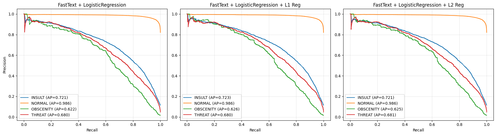
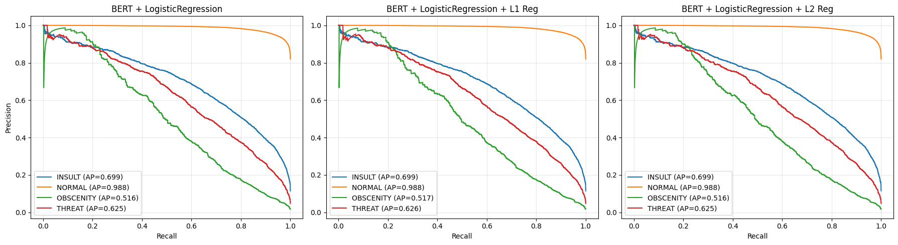
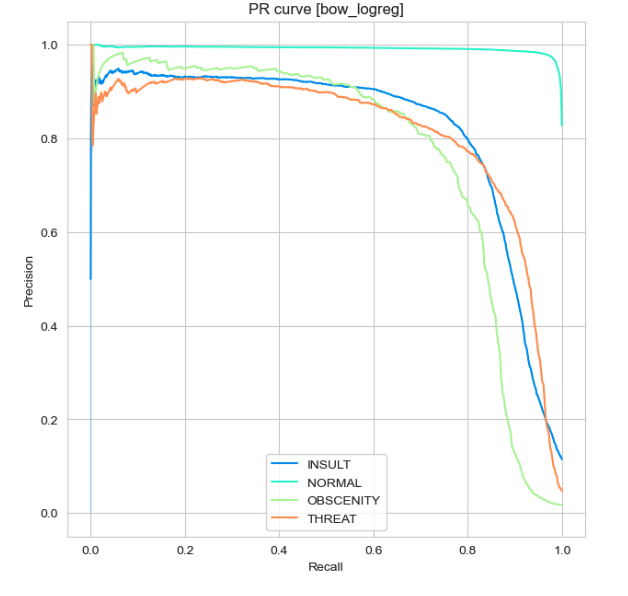
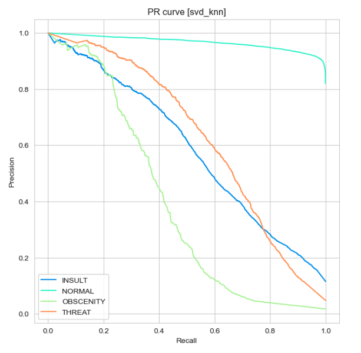
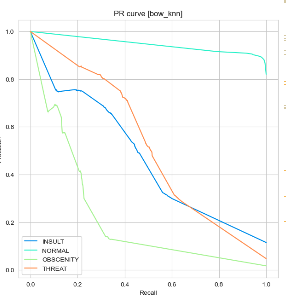

# Линейные ML-модели

## Ключевая метрика
В качестве ключевой метрики для нашей модели многоклассовой классификации была выбрана **F1 macro**, так как она подходит
для несбалансированных классов, а также учитывает одновременно и recall и precision. Дополнительно была рассмотрена 
метрика PR-AUC, чтобы оценить качество моделей без привязки к конкретному порогу.

## Сводная таблица результатов

| Признаки                            | Модель             | F1-macro |
|-------------------------------------|--------------------|----------|
| BoW                                 | LogisticRegression | 0.82     |
| fasttext                            | LogisticRegression | 0.7      |
| word2vec-araneum + кастомные признаки | LogisticRegression | 0.68     |
| BERT                                | LogisticRegression | 0.65     |
| word2vec-araneum                    | LogisticRegression | 0.63     |
| word2vec-araneum                    | KNN                | 0.61     |
| BoW + PCA                           | KNN           | 0.59     |
| word2vec-ruscorpora                 | KNN           | 0.58     |
| word2vec-ruscorpora                 | LogisticRegression           | 0.57     |
| BoW + PCA                           | LogisticRegression           | 0.57     |
| BoW                              | KNN           | 0.53     |
|BoW                      | SVM           | 0.83    |

## Описание моделей

### Модель fasttext + LogisticRegression

**Что делает fasttext:**  
1. Разбивает комментарий на слова  
2. Разбивает слова на n-граммы и находит вектор, соответствующей каждой n-грамме  
3. Суммирует все n-граммы, чтобы получить эмбеддинг слова  
4. Усредняет эмбеддинги всех слов в предложении, чтобы получить финальный эмбеддинг для комментария  

Преимущество fasttext по сравнению с более простыми техниками векторизации в том, что он может сопоставить вектор даже неизвестному слову. Но fasttext не учитывает порядок и контекст слов.

Далее мы обучаем LogisticRegression на эмбеддингах по каждому комментарию, находя оптимальные веса, и делаем предсказание по этой модели.

**Выводы:**  
Было построено 3 модели с FastText + LogisticRegression:  
- **без регуляризации** (F1 macro = 0.6997)  
- **с L1-регуляризацией** (F1 macro = 0.7)  
- **с L2-регуляризацией** (F1 macro = 0.699)  

То есть можно сказать, что по нашей ключевой метрике качества разницы в моделях нет. Нужно отметить, что другие метрики качества также не сильно различаются между моделями, но, например, **F1 weighted** показывает гораздо более высокое качество (~0.9), чем **F1 macro**, так как наиболее часто встречающийся класс мы предсказываем гораздо точнее, чем малочисленные классы.

При этом в каждой модели коэффициенты сосредоточены вокруг 0 и, как видно на PR-кривой, каждая лучше всего предсказывает класс NORMAL и хуже всего OBSCENITY.

Но у Lasso модели есть особенность в виде того, что она зануляет часть весов (в этом случае 48 весов), что немного облегчает дальнейшее использование. Поэтому будем считать, что **оптимальная модель FastText + LogisticRegression** — это модель с **L1-регуляризацией**.

### BERT + LogisticRegression

Используем предобученный BERT для получения эмбеддингов комментариев. Токенизатор разбивает комментарий на токены, а модель BERT вычисляет эмбеддинги для каждого токена в комментарии. Для получения итогового вектора для каждого комментария мы применяем операцию Mean Pooling (усредняем по всем токенам). Далее на этих векторах обучаем LogisticRegression и находим оптимальные веса.

**Выводы:**  
Было построено 3 модели с BERT + LogisticRegression:  
- **без регуляризации** (F1 = 0.6510)  
- **с L1-регуляризацией** (F1 = 0.6485)  
- **с L2-регуляризацией** (F1 = 0.6489)  

Значительной разницы в ключевой метрике качества нет, регуляризация не смогла улучшить изначальную модель.

При этом в каждой модели коэффициенты сосредоточены вокруг 0 (хотя даже L1-регуляризация не смогла их занулить) и, как видно на PR-кривой, каждая лучше всего предсказывает класс NORMAL и хуже всего OBSCENITY.

Будем считать, что **оптимальная модель BERT + LogisticRegression** — это модель **без регуляризации**, но даже она показывает невысокое качество

### Кастомные признаки + LogisticRegression

Признаки:

* количество символов в комментарии
* доля уникальных слов
* количество цифр в комментарии
* средняя длина слова
* признак наличия мата
* признак наличия негативных смайликов
* признак наличия позитивных смайликов
* признак наличия пошлых смайликов
* признак наличия императива
* признак наличия экспрессивной пунктуации
* признак наличия местоимений 2 лица

На кастомных признаках сначала была обучена модель бинарной логистической регрессии, которая показала хороший результат 
по F1 метрике 0.78. Мы объясняем это тем, что признак наличия мата имеет высокую корреляцию с токсичностью комментария,
однако достичь хороших показателей для мультиклассовой классификации на таких признаках не получилось, максимум f1-macro = 0.39
(подробнее можно прочитать [тут](./Sokolov/README.md))

В общем, появилось понимание, что для хорошего качества модели необходимо обрабатывать текст с помощью более глубоких способов,
а не просто через извлечение статистических признаков.

### word2vec-ruscorpora + LogisticRegression/KNN

- LogReg \[F1-macro\]: 0.57
- KNN \[F1-macro\]: 0.58

Word2vec дал значительный прирост к качеству модели. Однако многое зависит и от выбора самой word2vec модели, поскольку
в нашем датасете представлены комментарии с низкой лексикой (в том числе оскобрления и угрозы), поэтому ruscorpora может
быть не лучшим выбором, т.к. в этом корпусе не представлен или мало представлен массив текстов от интернет-пользователей. 
(подробнее [тут](./Sokolov/README.md) есть про обучение нелинейных моделей на этих векторах)

###  word2vec-araneum + LogisticRegression/KNN

Word2vec-araneum -  веб-корпус русскоязычных текстов

**- LogReg, F1-macro: 0.63**
**- KNN, F1-macro: 0.61**

Видно, что этот выбор был удачным, поскольку метрики сильно выросли по сравнению с ruscorpora.

###  (word2vec-araneum + кастомные признаки) + LogisticRegression

Далее можно попробовать улучшить результат за счет добавления к векторам числовых признаков.

- LogReg \[F1-macro\]: 0.679.

Подробнее в [ноутбуке](./Sokolov/models.ipynb)

### Bag of words + LogisticRegression

[Подробнее тут](./logreg_knn_kaigorodtseva.ipynb)

Признаки: словарь из 143944 слов и эмодзи. Слова приведены в начальную форму, а также удалены стоп слова.

**F1-macro: 0.82**

Для линейной модели и такого примитивного метода векторизации текста, который не учитывает контекст и порядок слов,
качество по F1-macro довольно высокое. Cкорее всего это связано с тем, что в данном датасете каждый класс токсичности
практически однозначно определяется набором лексики, характерным для этого класса (оскорбления, угрозы, непристойные предложения).

Модель дала максимальные веса словам по классам:
- INSULT
	- feature: пиздобол, weight: 85232
	- feature: долбоеб, weight: 29008
	- feature: выблядки, weight: 18227
- NORMAL
	- feature: кпсс, weight: 51427
	- feature: здравствовать, weight: 39451
	- feature: красота, weight: 51772
- OBSCENITY
	- feature: трахать, weight: 125362
	- feature: отсосать, weight: 79549
	- feature: трахнуть, weight: 125393
- THREAT
	- feature: расстрелять, weight: 104921
	- feature: растрелять, weight: 105135
	- feature: расстреливать, weight: 104906

Но подавляющее количество слов не несут ни какой информации для модели о классе комментария, поэтому была предпринята попытка 
сжать признаковое пространство таким образом, чтобы избавиться от необходимости хранить каждое слово, вместе с тем 
сохранить информацию о тональности комментария.

### PCA + LogisticRegression

[Подробнее тут](./logreg_knn_kaigorodtseva.ipynb)

Признаки: первые 500 компонент, полученных из SVD разложения матрицы слово-комментарий

**F1-macro: 0.57**

Количество компонент было подобрано по кросс-валидации на трейне. Результаты хуже, чем у логистической регрессии на всех словах.
Это ожидаемо, ведь мы теряем информацию о наличии определенных слов в каждом комментарии. Также, возможно в новом пространстве
невозможно хорошо линейно разделить классы комментариев, поэтому попробуем другие модели.

### PCA + KNN

[Подробнее тут](./logreg_knn_kaigorodtseva.ipynb)

Признаки: первые 400 компонент, полученных из SVD разложения матрицы слово-комментарий
Количество соседей: 40

**F1-macro: 0.59**

Количество компонент и соседей было подобрано по кросс-валидации на трейне. KNN в новом пространстве показал себя чуть лучше,
чем логистическая регрессия. Но все равно уступает по качеству логистической регрессии на всех словах.
Возможно, комментарии в новых координатах в целом хуже разделимы и нужно пробовать более сложные способы векторизации.

### BoW + KNN

[Подробнее тут](./logreg_knn_kaigorodtseva.ipynb)

Признаки: первые 1000 самых частых слов в датасете
Количество соседей: 40

**F1-macro: 0.53**

Размер словаря и соседей было подобрано по кросс-валидации на трейне. Несмотря на то, что KNN плохо работает в признаковых
пространствах большой размерности, эта модель была обучена ради интереса, чтобы сравнить с показателями модели обученной
на PCA компонентах.

### BoW + SVM 
Эта модель обучалась на тех же дополнительно предобработанных признаках, что и логичстическая регрессия. После подбора гиперпараметров мы получили f1 macro = 0.83.
Подробнее в ноутбуку SVM_Desyatnichenko, в