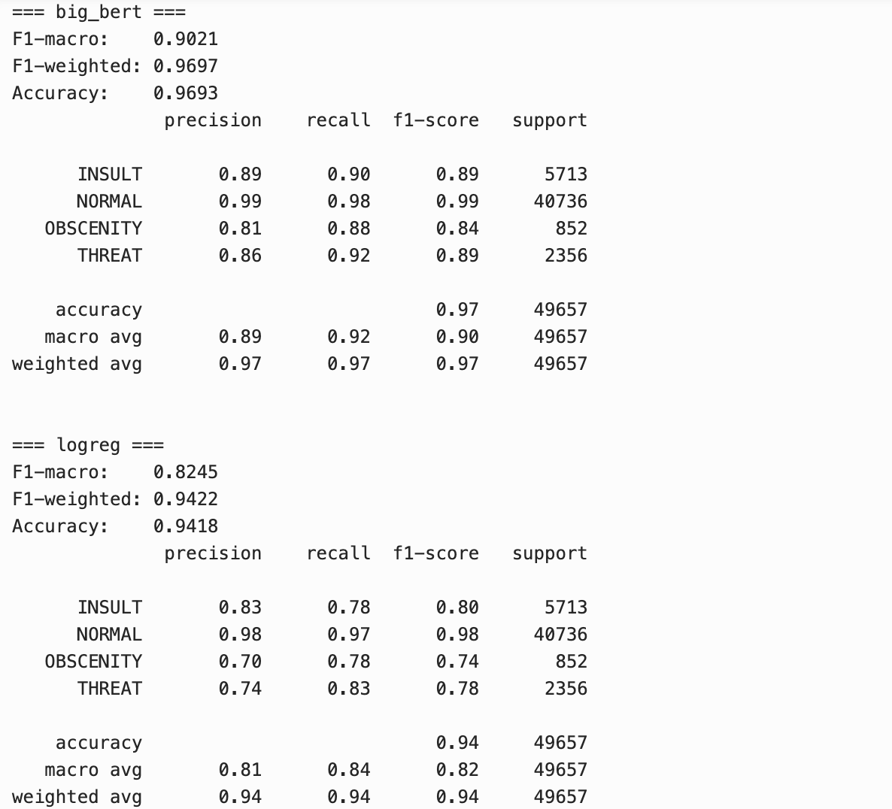
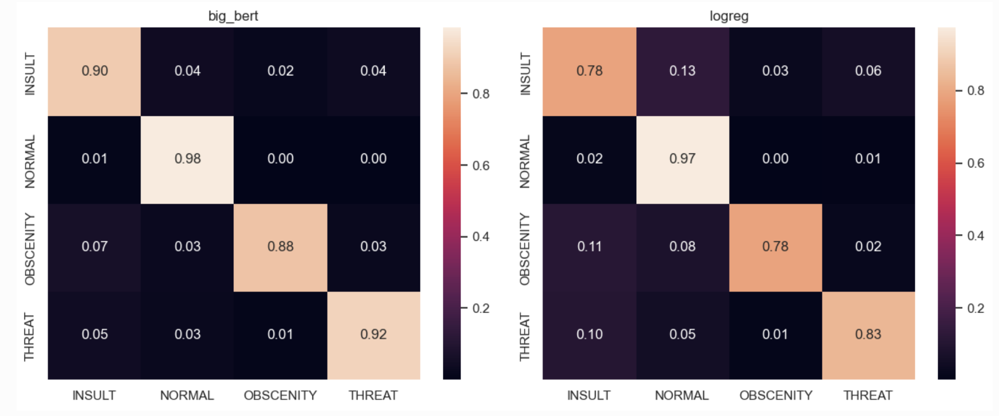
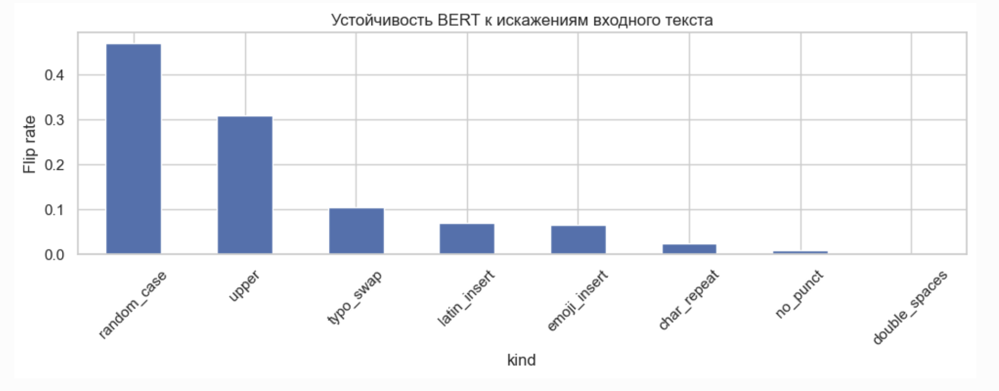

# Флоу версионирования

## Провести анализ ошибок модели

### Примеры ошибок

**1.** эмилия кравец хочет сдохнуть молодой. ха ха. :d

True **NORMAL** → Pred **INSULT** | margin=0.001 | теги: ложная токсичность

Top-3 proba: INSULT: 0.438, THREAT: 0.437, NORMAL: 0.109 

**2.** я что-то про москву написала? я написала про эти морды сытые и тупые.

True **NORMAL** → Pred **INSULT** | margin=0.006 | теги: ложная токсичность

Top-3 proba: INSULT: 0.502, NORMAL: 0.496, THREAT: 0.002

**3.** бизнесмен от иуды!

True **NORMAL** → Pred **INSULT** | margin=0.010 | теги: ложная токсичность, короткий текст

Top-3 proba: INSULT: 0.503, NORMAL: 0.494, THREAT: 0.001

**4.** даааа, время идёт, а идиотов, все больше и больше.....

True **INSULT** → Pred **NORMAL** | margin=0.008 | теги: пропуск токсичности

Top-3 proba: NORMAL: 0.502, INSULT: 0.494, THREAT: 0.003

**5.** эти шалашовки что умеют и для чего живут??????

True **INSULT** → Pred **NORMAL** | margin=0.011 | теги: пропуск токсичности

Top-3 proba: NORMAL: 0.504, INSULT: 0.493, OBSCENITY: 0.003

**6.** так не разрешают им отхандохать чучмеков по полной

True **INSULT** → Pred **NORMAL** | margin=0.014 | теги: пропуск токсичности

Top-3 proba: NORMAL: 0.420, OBSCENITY: 0.406, INSULT: 0.166

**7.** да, придурок, россия развалиться и ты вонючий козёл подохнешь!

True **INSULT** → Pred **THREAT** | margin=0.007 | теги: путаница подклассов токсичности

Top-3 proba: THREAT: 0.499, INSULT: 0.492, OBSCENITY: 0.007

**8.** пидарас который это сделал,иди маме своей в голову стрельни,что ебаната такого родила.мразь ссаная,только и можешь на беззащитных из пневматики стрелять?

True **INSULT** → Pred **THREAT** | margin=0.010 | теги: путаница подклассов токсичности

Top-3 proba: THREAT: 0.476, INSULT: 0.466, OBSCENITY: 0.058

**9.** вставил в зад,потехи ради, римскую свечу. пуля -в голове у дяди с долбоеба хочу!

True **INSULT** → Pred **THREAT** | margin=0.015 | теги: путаница подклассов токсичности

Top-3 proba: THREAT: 0.477, INSULT: 0.462, OBSCENITY: 0.055

**10.** плешивую криваногую тварь уже отимели все китай сша тварь это даже арабы вочередь выебали укр аина польша германия лукашенко потом даже параши пнул по плешивай твари и произнес твае место надеждой и только россияне ище смотрят на эту тварь о этот кривногий плешивый гандон обещал о лет будущее каторое уже не наступит никогда я четко вижу будущее рос…

True **INSULT** → Pred **OBSCENITY** | margin=0.006 | теги: путаница подклассов токсичности

Top-3 proba: OBSCENITY: 0.499, INSULT: 0.493, THREAT: 0.008

**11.** слушай ты в натуре что ли ишачий пидор, раз по себе всех равняешь закрой пасть хуем воняет тварь конченная.

True **INSULT** → Pred **OBSCENITY** | margin=0.006 | теги: путаница подклассов токсичности

Top-3 proba: OBSCENITY: 0.497, INSULT: 0.492, THREAT: 0.011

**12.** пускай все тебе отправят фото своего члена, вот и по росту хуя будешь определить.

True **INSULT** → Pred **OBSCENITY** | margin=0.027 | теги: путаница подклассов токсичности

Top-3 proba: OBSCENITY: 0.508, INSULT: 0.481, THREAT: 0.009

**13.** вы не представляете, как мне его хочется обозвать, когда он пытается потоптать петуха. зарезать, что то рука не поднимается.

True **NORMAL** → Pred **THREAT** | margin=0.002 | теги: ложная токсичность

Top-3 proba: THREAT: 0.486, NORMAL: 0.484, INSULT: 0.026

**14.** как полоснул, по ране бритвой........

True **NORMAL** → Pred **THREAT** | margin=0.011 | теги: ложная токсичность

Top-3 proba: THREAT: 0.497, NORMAL: 0.486, INSULT: 0.009

**15.** именно такие и митингующие......с такими требованиями , правда они это делают за деньги ....учатся новой профессии ----предателей , .... ненависников матери , которая их родила и кормит ( я о родине ) .....драть как сидоровых коз , ременякой , забытым дедовским методом , ооочень действеннен.

True **NORMAL** → Pred **THREAT** | margin=0.020 | теги: ложная токсичность

Top-3 proba: THREAT: 0.401, NORMAL: 0.381, INSULT: 0.208

### **Выводы** : 
1) BERT ошибается в 3% случаев
2) Основные типы ошибок:
    - Комментарий нормальный, но предсказало токсичный (42% всех ошибок)
    - Перепутан тип токсичности (36% ошибок)
    - Комментарий токсичный, но предсказало нормальный (22% ошибок)
3) Ошибки возникают по большему счету среди комментариев, которые либо при разметке были отнесены к неверному классу (из примеров выше: комментарии 2, 3, 15), либо которые сложно без контекста однозначно определить токсичный или нет (комментарий 1, 4, 13, 14), либо в которых в целом можно выделить несколько типов токсичности (комментарии 7, 8, 9, 11)
4) Корректировка данных возможна только при переразметке и переходе к multi-label задаче, то есть такой, в которой один комментарий может относиться сразу к нескольким классам

## Сравнение с baseline

Финальные метрики: 

Confusion matrix:

На тестовой выборке из почти 50 тыс. комментариев:

BERT верен, logreg нет: 1995
logreg верен, BERT нет: 627
Обе ошиблись: 896

### **Выводы** : 

В качестве baseline была взята модель BOW + LogisticRegression, которая довольно хорошо справилась с задачей за счет выделения конкретных слов-триггеров (мата и т.д.). Тем не менее BERT показывает F1-macro = 0.902, что существенно выше baseline (0.8245), так как BERT удается лучше работать с контекстом и улавливать общий смысл

## Проверка устойчивости (robustness)

В комментарии были внесены случайные изменения: случайное изменение регистра у отдельных букв (random_case), перевод комментария в верхний регистр (upper), замена одного пробела на два пробела подряд (double_spaces), удаление пунктуации (no_punct), добавление эмодзи (emoji_insert) и прочие опечатки

На графике изображено, в какой доле случаев предсказание модели менялось после применения изменения:

**Выводы:** 

1) BERT очень чувствителен к смене регистра: и к переводу всего комментария в верхний регистр, и к случайному изменению регистра у отдельных букв. Вероятно, дело в том, что в датасете, на котором обучались модели, изначально все комментарии были приведены к нижнему регистру
2) Опечатки и вставки влияют умеренно: перестановка букв местами (typo_swap) изменяют прогноз модели в ~10% случаев, добавление буквы на латинице в середину комментария (latin_insert) и вставка эмодзи (emoji_insert) чуть реже
3) Остальные изменения повлияли незначительно

В целом, если учитывать такую особенность, что изначальный датасет был полностью в нижнем регистре и для продакшена также передавать приведенные к нижнему регистру комментарии/сообщения, то можно сказать, что модель устойчива

Более подробную информацию по ошибкам, сравнению с baseline и robustness можно посмотреть в ноутбуке model_analysis.ipynb
