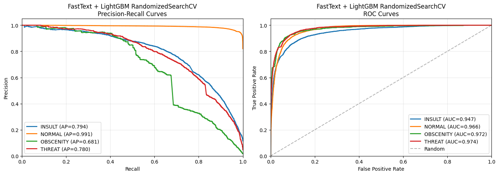
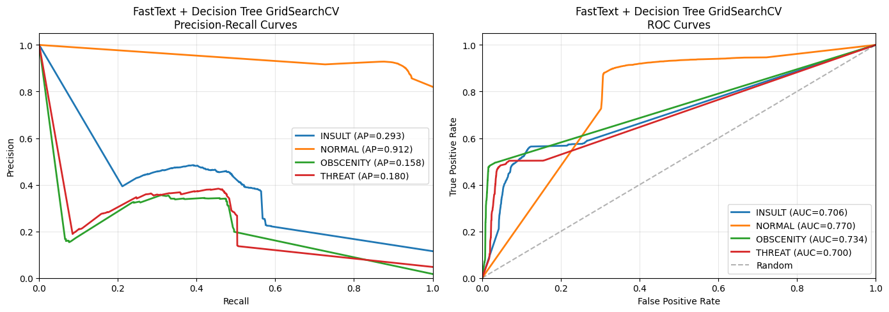

# Нелинейные ML-модели

## Сводная таблица результатов

| Признаки              | Модель             | F1-macro |
|-----------------------|--------------------|----------|
| fasttext              | LightGBM           | 0.75     |
| w2v + custom features | LightGBM + optuna  | 0.71     |
| BoW                   | RandomForest       | 0.65     |
| w2v                   | LightGBM           | 0.64     |
| fasttext              | Decision Tree      | 0.54     |
| w2v + custom features | RandomForest       | 0.53     |
| custom features       | RandomForest       | 0.42     |

## Описание моделей

### Модель fasttext + LightGBM

**Что делает fasttext:**  
1. Разбивает комментарий на слова  
2. Разбивает слова на n-граммы и находит вектор, соответствующей каждой n-грамме  
3. Суммирует все n-граммы, чтобы получить эмбеддинг слова  
4. Усредняет эмбеддинги всех слов в предложении, чтобы получить финальный эмбеддинг для комментария  

Преимущество fasttext по сравнению с более простыми техниками векторизации в том, что он может сопоставить вектор даже неизвестному слову. Но fasttext не учитывает порядок и контекст слов.

Далее мы обучаем LightGBM на эмбеддингах по каждому комментарию, с помощью RandomizedSearchCV подбирая оптимальные веса, и делаем предсказание по этой модели.

**Выводы:**  
Оптимальная модель FastText + LightGBM показывает неплохой результат: **F1 macro = 0.75**. При этом подбор гиперпараметров помог увеличить F1 macro незначительно по сравнению с baseline LightGBM. Это указывает на то, что baseline параметры были уже близки к оптимальным.
Модель отлично предсказывает класс Normal (F1-score = 0.96), но имеет некоторые проблемы с определением типа токсичности, особенно Obscenity (F1-score = 0.63)
 

Как видно на PR-кривой, каждая лучше всего предсказывает класс NORMAL и хуже всего OBSCENITY.

### Модель fasttext + DecisionTree

На тех же эмбеддингах строим baseline DecisionTree, а после пытаемся подобрать оптимальные гиперпараметры с помощью GridSearchCV

**Выводы:**  
Оптимальная модель FastText + DecisionTree показывает довольно плохой результат: **F1 macro = 0.54**. 

Регулиризация не помогает исправить высокое переобучение, из чего можно сделать вывод что решающие деревья не подходязтй метод для классификации токсичных комментариев

### Модель w2v araneum + LightGBM

**Как мы использвали w2v:**  

1) Прогнали все комментарии через лемматизатор stanza (это заняло много времени, т.к. это довольно мощный инструмент)
2) Векторизовали все слова через w2v
3) Усреднили эмбеддинги всех слов в предложении, чтобы получить финальный эмбеддинг для комментария

word2vec сохраняет семантические связи между словами — близкие по смыслу слова имеют похожие векторы, но как и fasttext, не учитывает порядок и контекст слов, а еще (в отличие от fast-text) не может обработать неизвестные слова (out-of-vocabulary), которые отсутствуют в словаре модели.

Далее мы обучили LightGBM на эмбеддингах по каждому комментарию, подбирая гиперпараметры через optuna.

**Выводы:** LightGBM + w2v (araneum) с правильными гиперпараметрами показывает результат  **F1 macro = 0.67**. Это хуже, чем fast-text. То есть для бейзлайна данной задачи fast-text явно подходит лучше, так как требует меньше ресурсов и времени на предобработку (не нужно лемматизировать перед этим) дает лучший результат. Скорее всего это происходит из-за того, что fast-text умеет обрабатывать незнакомые последовательности в отличие от w2v, а поскольку мы имеем дело с интернет-сленгом (и орфографией), то это становится определяющей особенностью.

### Модель LightGBM. w2v araneum + custom features

Мы сделали все то же, что и в прошлом шаге, но добавили разные созданные нами признаки

        [
        'length_sym',           # количество символов
        'length_words',         # количество слов
        'av_word_len',          # средняя длина слова
        'swearing',             # наличие мата
        'has_positive_emoji',   # наличие "положительного эмодзи"
        'has_negative_emoji',   # наличие "отрицательного эмодзи"
        'has_obscene_emoji',    # наличие "пошлого эмодзи"
        'imperative',           # наличие повелительного наклонения
        '2nd_prsn_count',       # количество обращений во 2 лице
        '3nd_prsn_count',       # количество обращений в 3 лице
        'adj_count',            # количество прилагательных
        'vocative',             # наличие обращения
        'unique_fraction',      # доля уникальных слов
        'num_digits',           # количество цифр
        'non_cyrillic',         # количество некрииллических символов
        'has_link'              # наличие ссылки
        ]

**Выводы:** LightGBM + w2v (araneum) c кастомными признаками с правильными гиперпараметрами показывает результат  **F1 macro = 0.71**. Это лучше чем без кастомных признаков, но все еще хуже бейзлайна fast-text.

### Модель RandomForest. w2v araneum + custom features

**Выводы:** RandomForest + w2v (araneum) c кастомными признаками показывает результат  **F1 macro = 0.53**. Этот результат сопоставим с тем, что удалось получить в fast-text + Decision Tree. 